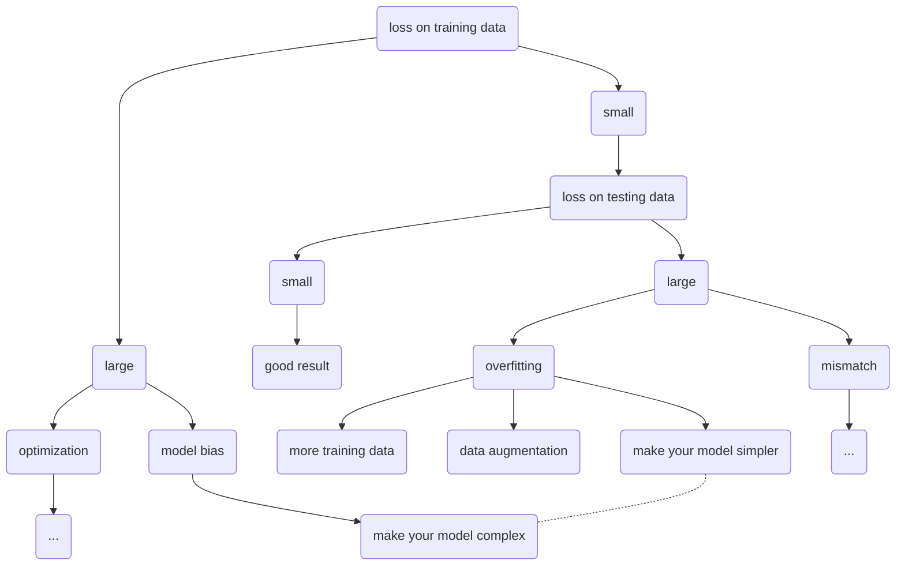

# 机器学习

让机器具备找一个函数的能力

## Introduction

### 一. Different types of Functions

#### 1. Regression(回归)

通过regression找到的function，输出是一个scalar数值

比如PM2.5的预测，给machine的training data是过去的PM2.5资料，而输出的是对未来PM2.5的预测数值，这就是一个典型的regression的问题

#### 2. Classification(分类)

##### Binary Classification(二元分类)

在binary classification里，我们要机器输出的是yes or no，是或否

比如G-mail的spam filtering(垃圾邮件过滤器)，输入是邮件，输出是该邮件是否是垃圾邮件

##### Multi-class classification(多元分类)

在multi-class classification里，机器要做的是选择题，等于给他数个选项，每一个选项就是一个类别，它要从数个类别里面选择正确的类别

比如document classification(新闻文章分类)，输入是一则新闻，输出是这个新闻属于哪一个类别(选项)。再比如阿法狗。

#### 3. Structured Learning

让机器学会创造

### 二. How to find a function

#### 1. Function with Unknown Parameters

weight, bias

#### 2. Define Loss from Training Data

L(w, b)：展现预估结果与真实结果(label)的差距，用来判断函数所得到的值的好坏。

#### 3. Optimization

Gradient Descent：先随机选取一个 w 点，求取该点的微分。若斜率为负，该点向正方向移动；若斜率为正，该点向负方向移动。移动的步伐取决于该点的斜率和 learning rate。不断迭代更新 w。多个参数同理(把 w 替换成参数组成的向量即可)。

容易陷入 local minima(局部极小值)。但不是大问题。

训练时，将样本分为许许多多个 [batch](#batch)，每一个 batch 都更新迭代一次参数。运行完所有的 batch 叫做一个 epoch。
比如：有 10000 个样本(N = 10000)，batch size = 10。则每一个 epoch 更新 1000 次参数。

**ps**：机器学习中需要自己设置的参数叫做 hyperparameters(超参数)

### 三. 选择 model

* Linear Model (线性模型)：最简单的模型

* Activation function (激励函数)：可在外层套上一个 sigmoid 函数。用多个 sigmoid 可以使直线分成很多折线，可以用来逼近非线性模型。

* 其他一些激励函数如：ReLU

Neural Network 模型：

## Tips for Training

### 如果训练过程中 loss 过大可能的问题

1. optimization 不够好

2. over fitting

3. Model Bias(来自于model的限制)

**优化步骤如下**：

data augmentation：创造样本，比如反转图片，放大缩小

mismatch：训练资料和测试资料分布不同

**数据验证方法**：

1. Cross Validation(交叉验证)：将 Training Set 分成 Training Set 和 Validation Set

2. N-fold Cross Validation(k-重交叉验证)：比如将 Training Set 分成三份。先第一份和第二份当 Training Set，第三份当 Validation Set；再第一份和第三份当 Training Set，第二份当 Validation Set；再第二份和第三份当 Training Set，第一份当 Validation Set。训练以上三个模型，看三个模型哪种结果最好。

#### Optimization 不够理想

**Loss 变为 0 可能的原因**：以下两点可统称为 critical point

1. local minima：并没有那么常见

2. saddle point(鞍点)：更为常见

### 两种训练技

可用来对抗 local minima 或 saddle point

#### 1. batch

训练时，将样本分为许许多多个 batch，每一个 batch 都更新迭代一次参数。运行完所有的 batch 叫做一个 epoch。为了确保随机性，需要 Shuffle after each epoch。

**为什么要用 batch**：如果不用 batch(大的batch，如 batch_size = N)，需要全部看完所有数据，才会跟新一次参数。得到~~结果时间很长~~但每一步都很稳。
用 batch(小的 batch) 后，每看完一个 batch 就跟新一次参数。~~所需时间短~~，更加 noisy。

然而实际上 noisy update 对训练更有利，而大的 batch 运行的时间反而更短(由于 GPU 的平行运算)。总之，运用 batch 是有利于训练的。

#### 2. Momentum

Gradient Descent：每次移动参数点向着斜率的反方向移动。

Gradient Descent + Momentum：每次移动参数点的方向由斜率反方向与前一步移动方向决定。可以理解成两个方向的合成。

由下图可以看到该点是有可能跨过local minima 或 saddle point的：
